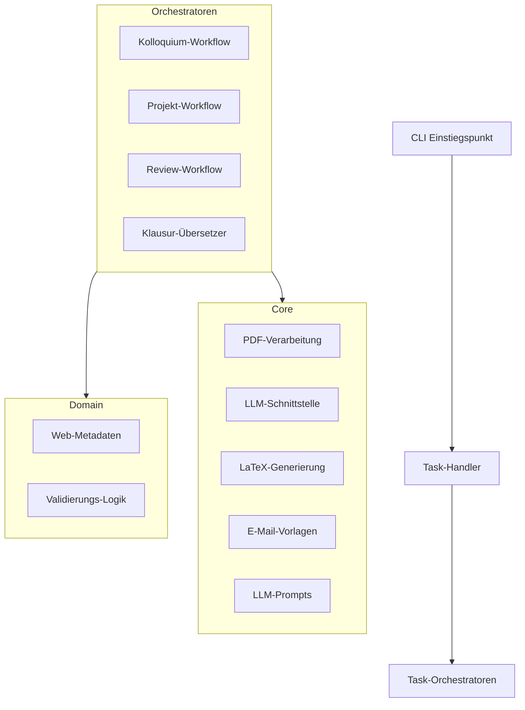

# Architektur-Übersicht

## System-Design

## Zentrale Design-Patterns

### 1. Orchestrator-Pattern
Jede Hauptaufgabe (Kolloquium, Projekt, Review) wird von einem Orchestrator verwaltet, der die Koordination zwischen verschiedenen Kerndiensten und der Domänenlogik übernimmt.

### 2. Pipeline-Phasen
Workflows folgen im Allgemeinen diesen Phasen:
1. **Extraktion**: Abrufen von Text, Annotationen und Metadaten aus Quelldokumenten (PDF/LaTeX).
2. **Transformation**: Nutzung von LLMs zum Umschreiben, Zusammenfassen oder Übersetzen von Inhalten.
3. **Generierung**: Erstellung von Ausgabedokumenten (LaTeX, Markdown, ICS, E-Mails).
4. **Kompilierung**: Optionales Kompilieren von LaTeX zu PDF.

### 3. Zentralisierte Vorlagen
- **Prompts**: Alle LLM-Prompts sind zentral in `core/prompts.py` definiert.
- **E-Mails**: E-Mail-Vorlagen befinden sich in `core/email.py`.
- **LaTeX**: Dokumentvorlagen sind als f-strings in `core/latex.py` implementiert.

### 4. Dependency Injection
LLM-Clients werden in Orchestratoren injiziert, was das Testen mit Mocks erleichtert und die Unterstützung mehrerer LLM-Provider ermöglicht.

## Modul-Verantwortlichkeiten

| Modul | Verantwortung |
|--------|---------------|
| `core/pdf.py` | Extraktion von Text und Annotationen aus PDFs |
| `core/llm.py` | Hochgradige LLM-Interaktionen (Umschreiben, Zusammenfassen) |
| `core/latex.py` | LaTeX-Escaping, Templating und Kompilierung |
| `core/email.py` | E-Mail-Empfängerdaten und Nachrichtenvorlagen |
| `core/prompts.py` | Zentralisierte LLM-Prompt-Vorlagen |
| `domain/metadata.py` | Generierung von Jekyll-kompatiblen Web-Metadaten |
| `domain/validation.py` | Konfigurations- und Umgebungsvalidierung |
| `colloquium/orchestrator.py` | Orchestrierung des Kolloquium-Workflows |
| `project/orchestrator.py` | Orchestrierung des Projekt-Benotungs-Workflows |
| `cli.py` | Argument-Parsing und Haupteinstiegspunkte |
| `handlers.py` | Routing von CLI/Konfig-Befehlen an Orchestratoren |

## Unterstützte LLM APIs

Das Tool wählt automatisch die beste verfügbare API basierend auf Ihrer Konfiguration aus.

| API | Standard-Modell | API-Key erforderlich | Hinweise |
|-----|---------------|------------------|-------|
| OpenAI | `gpt-4o-mini` | Ja | Zuverlässig, ca. $0.01-0.05/Thesis |
| Groq | `moonshotai/kimi-k2-instruct-0905` | Ja | Sehr schnell, kostenlose Stufe (30 req/min) |
| Google Gemini | `gemini-2.0-flash-exp` | Ja | Schnell, kostenlose Stufe (60 req/min) |
| Ollama | `llama3.2:1b` | Nein | Läuft lokal, komplett kostenlos |
