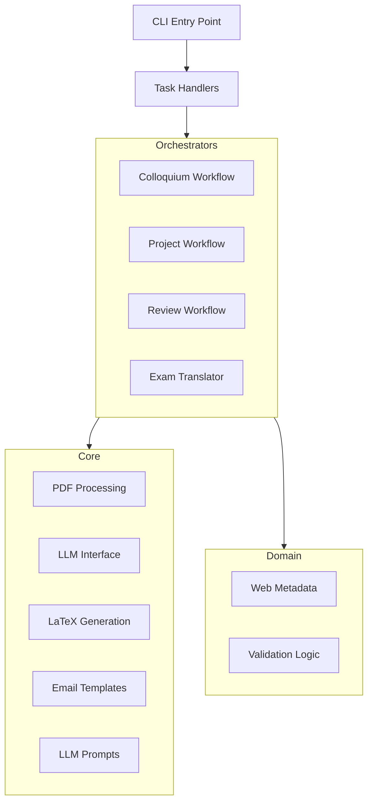

# Architecture Overview

## System Design

## Key Design Patterns

### 1. Orchestrator Pattern
Each major task (colloquium, project, review) is managed by an orchestrator that coordinates between various core services and domain logic. Orchestrators accept consolidated configuration dataclasses.

### 2. Pipeline Stages
Workflows generally follow these stages:  
1. **Extract**: Retrieve text, annotations, and metadata from source documents (PDF/LaTeX).  
2. **Transform**: Use LLMs to rewrite, summarize, or translate content.  
3. **Generate**: Create output documents (LaTeX, Markdown, ICS, Emails).  
4. **Compile**: Optionally compile LaTeX to PDF.  

### 3. Centralized Templates  
- **Prompts**: All LLM prompts are centralized in `core/prompts.py` using an Enum.  
- **Emails**: Email templates are defined in `core/email.py` using a Protocol-based system.  
- **LaTeX**: Document templates are implemented as raw f-strings in `core/latex.py`.  

### 4. Dependency Injection
LLM clients are injected into orchestrators and core functions, allowing for easier testing with mocks and supporting multiple LLM providers (OpenAI, Groq, Gemini, Ollama).

## File Responsibilities

| Module | Responsibility |
|--------|---------------|
| `core/pdf.py` | Extract text and annotations from PDFs |
| `core/llm.py` | High-level LLM interactions (rewriting, summarization) |
| `core/latex.py` | LaTeX escaping, templating, and compilation |
| `core/email.py` | Email recipient data and message templates |
| `core/prompts.py` | Centralized LLM prompt templates |
| `domain/metadata.py` | Generation of Jekyll-compatible web metadata |
| `domain/validation.py` | Configuration and environment validation |
| `colloquium/orchestrator.py` | Thesis colloquium workflow orchestration |
| `project/orchestrator.py` | Project work grading workflow orchestration |
| `cli.py` | Argument parsing and main entry points |
| `handlers.py` | Routing CLI/Config commands to orchestrators |

## Supported LLM APIs

The tool automatically selects the best available API based on your configuration.

| API | Default Model | API Key Required | Notes |
|-----|---------------|------------------|-------|
| OpenAI | `gpt-4o-mini` | Yes | Reliable, ~$0.01-0.05/thesis |
| Groq | `moonshotai/kimi-k2-instruct-0905` | Yes | Very fast, free tier (30 req/min) |
| Google Gemini | `gemini-2.0-flash-exp` | Yes | Fast, free tier (60 req/min) |
| Ollama | `llama3.2:1b` | No | Runs locally, completely free |
