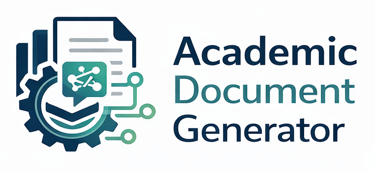
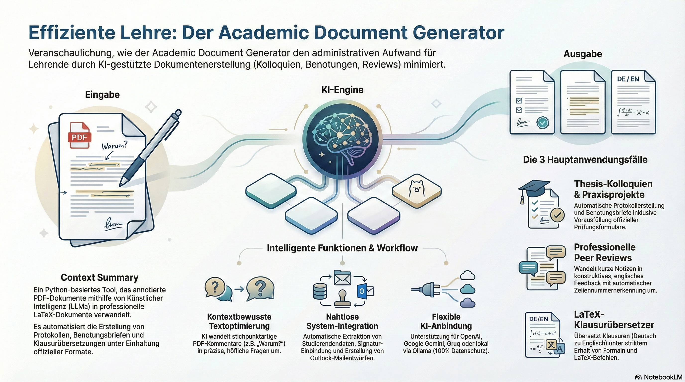

  

Welcome to the Academic Document Generator documentation!

Transform annotated PDFs into professional LaTeX documents using AI. Generate thesis colloquium protocols, project grading letters, peer review comments, and translate LaTeX exams automatically.

---

## 📊 Four Main Use Cases

-   :material-school:{ .lg .middle } __🎓 Colloquium Protocols__

    ---

    - Notes → clear questions
    - Auto-metadata extraction
    - Thesis summary
    - Form pre-filling
    - Email generation

    [:octicons-arrow-right-24: Documentation](COLLOQUIUM.md)

-   :material-file-document:{ .lg .middle } __📊 Project Work Grading__

    ---

    - Metadata extraction
    - Salutation determination (Mr/Ms)
    - Grading letter template
    - Feedback summary
    - Student email

    [:octicons-arrow-right-24: Documentation](PROJECT.md)

-   :material-pencil:{ .lg .middle } __✍️ Peer Review Comments__

    ---

    - Notes → constructive feedback
    - Auto line number detection
    - Markdown export
    - Always in English
    - Scientific tone

    [:octicons-arrow-right-24: Documentation](REVIEW.md)

-   :material-translate:{ .lg .middle } __🔤 LaTeX Exam Translator__

    ---

    - German → English
    - Exam class optimized
    - Preserves math formulas
    - Protected comments
    - Structure-aware

    [:octicons-arrow-right-24: Documentation](TRANSLATOR.md)

---

## 🎯 Quick Links

-   :material-clock-fast:{ .lg .middle } __Quick Start__

    ---

    Get started in minutes with our installation guide

    [:octicons-arrow-right-24: Installation](INSTALL.md)

-   :material-cog:{ .lg .middle } __Configuration__

    ---

    Configure your LLM APIs and templates

    [:octicons-arrow-right-24: Configuration Guide](configuration.md)

-   :material-file-find:{ .lg .middle } __Examples__

    ---

    View examples of generated documents

    [:octicons-arrow-right-24: Example Outputs](EXAMPLES.md)

-   :material-code-braces:{ .lg .middle } __API Reference__

    ---

    Complete API documentation for developers

    [:octicons-arrow-right-24: API Docs](api_reference/index.md)

## ✨ Key Features

- 🚀 **Unified CLI** - Single `academic-doc-generator` command for all tasks
- 🔍 **PDF Annotation Extraction** - Extract text and annotation positions with Docling + PyPDF
- 🤖 **Multiple LLM Support** - Works with OpenAI, Groq, Google Gemini, or Ollama
- 🎯 **Context-Aware Rewriting** - Maps annotations to exact highlighted text and paragraphs
- ✍️ **Intelligent Comment Refinement** - Rewrites terse notes into full questions
- 📝 **LaTeX Generation** - Creates professional letters with TH Köln formatting
- ✒️ **Automatic Signature Detection** - Automatically includes signature from `data/signature.png`
- 📋 **PDF Form Pre-filling** - Auto-fills official grading forms (auto-mapped to course of study)
- 📧 **Email & Outlook Integration** - Creates registration emails and Outlook drafts
- 🌐 **Unicode Support** - Handles German special characters correctly

## 🛠️ Requirements

- **Python**: 3.9 or higher
- **LaTeX**: LuaLaTeX recommended (for Unicode support)
- **LLM API**: At least one of OpenAI, Groq, Gemini, or Ollama

## 🤝 Contributing

Contributions are welcome! Please see [CONTRIBUTING.md](CONTRIBUTING.md) for guidelines.

## 📄 License

This project is released under the MIT License.

---

**Note:** This tool aids in document template creation — it does not mark or make evaluative decisions automatically. All academic assessments remain the responsibility of the examiner.
