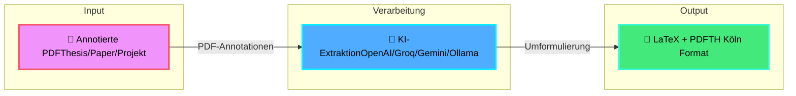

# Academic Document Generator Documentation

<style>
.workflow-container {
    display: grid;
    grid-template-columns: 1fr auto 1fr auto 1fr;
    gap: 20px;
    align-items: center;
    margin: 40px 0;
    padding: 30px;
    background: linear-gradient(135deg, var(--md-primary-fg-color) 0%, var(--md-accent-fg-color) 100%);
    border-radius: 8px;
}

.workflow-box {
    background: var(--md-default-bg-color);
    padding: 25px;
    border-radius: 8px;
    text-align: center;
    box-shadow: 0 4px 6px rgba(0,0,0,0.1);
}

.workflow-box .icon {
    font-size: 3rem;
    margin-bottom: 10px;
}

.workflow-box h3 {
    margin: 10px 0;
    color: var(--md-primary-fg-color);
}

.workflow-arrow {
    font-size: 2rem;
    color: var(--md-default-bg-color);
    font-weight: bold;
}

@media (max-width: 76.1875em) {
    .workflow-container {
        grid-template-columns: 1fr;
        gap: 15px;
    }
    .workflow-arrow {
        transform: rotate(90deg);
    }
}
</style>

<div class="workflow-container">
    <div class="workflow-box">
        <div class="icon">📄</div>
        <h3>Eingabe</h3>
        <p>Annotierte PDF</p>
    </div>
    
    <div class="workflow-arrow">→</div>
    
    <div class="workflow-box">
        <div class="icon">🤖</div>
        <h3>KI-Verarbeitung</h3>
        <p>LLM extrahiert & formuliert</p>
    </div>
    
    <div class="workflow-arrow">→</div>
    
    <div class="workflow-box">
        <div class="icon">📝</div>
        <h3>Ausgabe</h3>
        <p>LaTeX + PDF</p>
    </div>
</div>

Welcome to the Academic Document Generator documentation!

Transform annotated PDFs into professional LaTeX documents using AI. Generate thesis colloquium protocols, project grading letters, peer review comments, and translate LaTeX exams automatically.

---

## 🎯 Workflow auf einen Blick



## 📊 Vier Hauptanwendungsfälle

<div class="grid cards" markdown>

-   :material-school:{ .lg .middle } __🎓 Kolloquium-Protokolle__

    ---

    - Notizen → klare Fragen
    - Auto-Metadaten-Extraktion  
    - Thesis-Zusammenfassung
    - Formular-Ausfüllung
    - E-Mail-Generierung

    [:octicons-arrow-right-24: Dokumentation](COLLOQUIUM.md)

-   :material-file-document:{ .lg .middle } __📊 Praxisprojekt-Benotung__

    ---

    - Metadaten-Extraktion
    - Anrede-Bestimmung (Herr/Frau)
    - Bewertungsbrief-Vorlage
    - Feedback-Zusammenfassung
    - Studierenden-E-Mail

    [:octicons-arrow-right-24: Dokumentation](PROJECT.md)

-   :material-pencil:{ .lg .middle } __✍️ Peer Review Kommentare__

    ---

    - Notizen → konstruktives Feedback
    - Auto-Zeilennummern-Erkennung
    - Markdown-Export
    - Immer auf Englisch
    - Wissenschaftlicher Ton

    [:octicons-arrow-right-24: Dokumentation](REVIEW.md)

-   :material-translate:{ .lg .middle } __🔤 LaTeX-Klausur-Übersetzer__

    ---

    - Deutsch → Englisch
    - Exam-Klasse optimiert
    - Mathe-Formeln erhalten
    - Kommentare geschützt
    - Struktur-bewusst

    [:octicons-arrow-right-24: Dokumentation](TRANSLATOR.md)

</div>

---

## 🎯 Quick Links

<div class="grid cards" markdown>

-   :material-clock-fast:{ .lg .middle } __Quick Start__

    ---

    Get started in minutes with our installation guide

    [:octicons-arrow-right-24: Installation](INSTALL.md)

-   :material-file-document:{ .lg .middle } __Use Cases__

    ---

    Learn about the four main use cases

    [:octicons-arrow-right-24: Colloquium Protocols](COLLOQUIUM.md)
    [:octicons-arrow-right-24: Project Grading](PROJECT.md)
    [:octicons-arrow-right-24: Peer Reviews](REVIEW.md)
    [:octicons-arrow-right-24: Exam Translation](TRANSLATOR.md)

-   :material-cog:{ .lg .middle } __Configuration__

    ---

    Configure your LLM APIs and templates

    [:octicons-arrow-right-24: Configuration Guide](configuration.md)

-   :material-code-braces:{ .lg .middle } __API Reference__

    ---

    Complete API documentation for developers

    [:octicons-arrow-right-24: API Docs](api_reference/index.md)

</div>

## ✨ Key Features

- 🚀 **Unified CLI** - Single `academic-doc-generator` command for all tasks
- 🔍 **PDF Annotation Extraction** - Extract text and annotation positions with Docling + PyPDF
- 🤖 **Multiple LLM Support** - Works with OpenAI, Groq, Google Gemini, or Ollama
- 🎯 **Context-Aware Rewriting** - Maps annotations to exact highlighted text and paragraphs
- ✍️ **Intelligent Comment Refinement** - Rewrites terse notes into full questions
- 📝 **LaTeX Generation** - Creates professional letters with TH Köln formatting
- ✒️ **Automatic Signature Detection** - Automatically includes signature from `data/signature.png`
- 📋 **PDF Form Pre-filling** - Auto-fills official grading forms (auto-mapped to course of study)
- 📧 **Email & Outlook Integration** - Creates registration emails and Outlook drafts
- 🌐 **Unicode Support** - Handles German special characters correctly

## 🎓 Four Main Use Cases

### 1. Thesis Colloquium Protocols

Generate formal protocol letters for Bachelor/Master thesis colloquiums:

```bash
academic-doc-generator colloquium thesis.pdf --date 20.01.2026 --time 14:00 --room 3.217
```

**Features:**
- Extract and rewrite annotations into clear questions
- Auto-detect student metadata and course of study
- Generate thesis summary
- Create LaTeX letter with TH Köln formatting
- Pre-fill grading forms with course-specific checkboxes

[→ Full Documentation](COLLOQUIUM.md)

### 2. Project Work Grading Letters

Generate grading letters for project work (Praxisprojekt):

```bash
academic-doc-generator project /path/to/Praxisprojekt.pdf
```

**Features:**
- Auto-extract project metadata and student email
- Determine formal German address (Herr/Frau)
- Create LaTeX grading letter template
- Automatically generate feedback summary and student email

[→ Full Documentation](PROJECT.md)

### 3. Peer Review Comments

Generate professional peer review feedback for papers:

```bash
academic-doc-generator review paper.pdf
```

**Features:**
- Extract and rewrite reviewer notes
- Auto-detect line numbers
- Generate Markdown review document
- Always output in English

[→ Full Documentation](REVIEW.md)

### 4. LaTeX Exam Translation

Automatically translate LaTeX exam documents from German to English:

```python
from llm_client import LLMClient
from academic_doc_generator.exam_translator import translate_latex_exam

client = LLMClient()
output_path = translate_latex_exam("KIKlausur.tex", client)
```

**Features:**
- Designed for the LaTeX `exam` class
- Preserves structure, math, and LaTeX commands
- Masks and preserves LaTeX comments
- Structure-aware translation (preamble, questions)

[→ Full Documentation](TRANSLATOR.md)

## 🚀 Quick Start

### Installation

```bash
# Clone repository
git clone https://github.com/dgaida/colloquium-protocol-creator.git
cd colloquium-protocol-creator

# Install
pip install -e .
```

### API Configuration

Create `secrets.env` in project root:

```bash
# Choose one or more
OPENAI_API_KEY=sk-xxxxxxxx          # Paid, reliable
GROQ_API_KEY=gsk-xxxxxxxx           # Free tier available
GEMINI_API_KEY=AIzaSy-xxxxxxxx      # Free tier available
# Or use Ollama (no key needed)
```

### Basic Usage

```bash
# List available templates
academic-doc-generator --list-templates

# Use a configuration template
academic-doc-generator --config config_templates/config_colloquium_campus.json
```

## 📊 System Architecture

```
┌─────────────────┐         ┌──────────────────┐         ┌─────────────────┐
│   Annotated     │         │   Multi-LLM      │         │   LaTeX         │
│   PDF / LaTeX   │────────►│   Processing     │────────►│   Document      │
│   (Source)      │ Extract │   (Rewriting)    │ Generate│   (Protocol)    │
└─────────────────┘         └──────────────────┘         └─────────────────┘
        │                            │                            │
        │                            │                            │
        ▼                            ▼                            ▼
┌─────────────────┐         ┌──────────────────┐         ┌─────────────────┐
│   Docling +     │         │   OpenAI/Groq/   │         │   PDF Form /    │
│   PyPDF         │         │   Gemini/Ollama  │         │   Email Drafts  │
└─────────────────┘         └──────────────────┘         └─────────────────┘
```

## 🤖 Supported LLM APIs

| API | Default Model | API Key Required | Notes |
|-----|---------------|------------------|-------|
| OpenAI | `gpt-4o-mini` | Yes | Reliable, ~$0.01-0.05/thesis |
| Groq | `moonshotai/kimi-k2-instruct-0905` | Yes | Very fast, free tier (30 req/min) |
| Google Gemini | `gemini-2.0-flash-exp` | Yes | Fast, free tier (60 req/min) |
| Ollama | `llama3.2:1b` | No | Runs locally, completely free |

The tool automatically selects the best available API based on your configuration.

## 📝 Configuration Templates

Pre-built JSON configurations for common workflows:

- `config_colloquium_campus.json` - Campus colloquium
- `config_colloquium_company.json` - Company colloquium
- `config_colloquium_online.json` - Online colloquium via Zoom
- `config_project_template.json` - Project work grading
- `config_review_template.json` - Peer review comments

[→ Configuration Guide](configuration.md)

## 🧪 Example Outputs

### Thesis Colloquium Letter

```latex
\documentclass[11pt,ngerman,parskip=full]{scrlttr2}
% TH Köln letterhead
\setkomavar{subject}{Bewertung Bachelor Arbeit von Max Mustermann}

% Summary
\textbf{Zusammenfassung der Thesis:}
Die Arbeit behandelt...

% Questions
\textbf{Fragen Prof. Dr. Müller:}
Seite 5: Könnten Sie die Wahl dieser Methodik näher begründen?
Seite 12: Wie verhält sich der Algorithmus bei größeren Datenmengen?
```

### Peer Review Comments

```markdown
# Peer Review

- Page 1, Line 15: This point requires clarification...
- Page 2, Line 42: The explanation could be clearer by...
- Page 3, Line 78: The authors should consider recent work by...
```

## 🛠️ Requirements

- **Python**: 3.9 or higher
- **LaTeX**: LuaLaTeX recommended (for Unicode support)
- **LLM API**: At least one of OpenAI, Groq, Gemini, or Ollama

## 🤝 Contributing

Contributions are welcome! Please see [CONTRIBUTING.md](CONTRIBUTING.md) for guidelines.

## 📄 License

This project is released under the MIT License.

## 🔗 Related Projects

- [llm_client](https://github.com/dgaida/llm_client) - Universal Python LLM client

## 📞 Support

- 📖 [Documentation](https://dgaida.github.io/colloquium-protocol-creator/)
- 🐛 [Report Issues](https://github.com/dgaida/colloquium-protocol-creator/issues)
- 💬 [Discussions](https://github.com/dgaida/colloquium-protocol-creator/discussions)

---

**Note:** This tool aids in document template creation — it does not mark or make evaluative decisions automatically. All academic assessments remain the responsibility of the examiner.
